# Setting up the Development Environment for Operating Systems II

## 🎯Objective
Establish a consistent and efficient working environment to serve as the foundation for subsequent labs in Operating Systems II. In this lab, students will configure GitHub Actions for Continuous Integration/Continuous Deployment (CI/CD), utilize [unity](https://www.throwtheswitch.org/unity) as a testing framework, and employ CMake to manage project construction.

## 🔑 Steps to Follow

### 📌 CMake Configuration

1. Use CMake to manage project construction independently of the operating system.
2. Create appropriate CMakeLists.txt files for the project, defining necessary directories, libraries, and executables.
3. Configure CMake correctly to generate projects, as executable and or libraries.

### 📌 unity Integration

1. Integrate the unity testing framework into the project.
2. Configure necessary dependencies and structure the code to enable the writing and execution of unit tests.
3. Create an initial set of unit tests to ensure the proper functioning of key components.

### 📌 GitHub Actions Configuration

1. Create a GitHub Actions configuration file in the repository.
2. Include steps for compiling the code, running tests, and optionally deploying the project.
3. Configure specific workflows for pull requests.

## 〽️ Importance of the Lab

- **Consistency and Reproducibility:** Ensures a homogeneous environment, reducing errors related to individual configurations.
- **Development Efficiency:** Implementation of CI/CD with GitHub Actions automates compilation and test execution, improving development efficiency.
- **Code Quality:** Integration of unity and unit tests encourages the development of robust code and facilitates early issue detection.
- **Portability and Scalability:** Configuration with CMake ensures the project is easily portable and scalable as new components are added.

This lab establishes the groundwork for effective, collaborative, and high-quality development in subsequent projects of Operating Systems II by instilling essential practices in CI/CD, testing, and code construction.

--- 

# PART I: Setting Up Development Environment for Operating Systems II

## 🎯Objective
Establish a consistent and efficient working environment as a foundation for subsequent labs in Operating Systems II. In this lab, students will configure GitHub Actions for Continuous Integration/Continuous Deployment (CI/CD), utilize [Unity](https://www.throwtheswitch.org/unity) as a testing framework, and employ CMake to manage project building.

## 🔑 Steps to Follow

### 📌 CMake Configuration

1. Use CMake to manage project building independently of the operating system.
2. Create suitable CMakeLists.txt files for the project, defining necessary directories, libraries, and executables.
3. Properly configure CMake to generate projects like executables and/or libraries.

#### Solution

  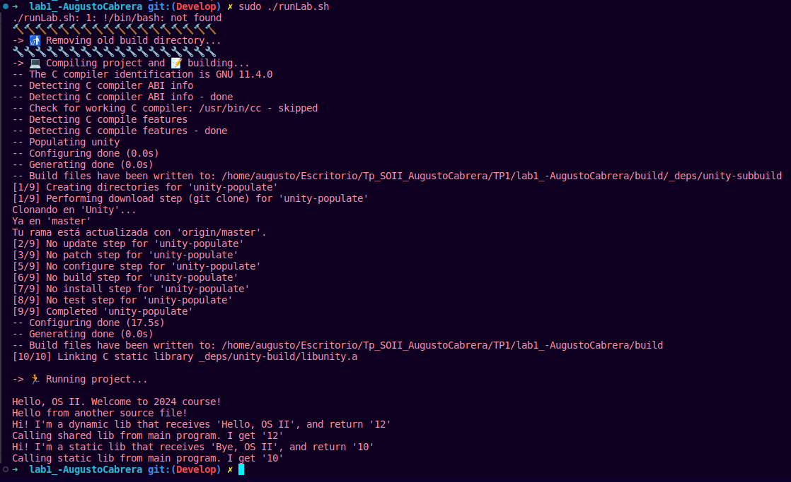

This shell script compiles using CMake and Ninja, and then runs the resulting project. Here's what each part of the script does:

- **#!/bin/bash -e:** Indicates that the script should be interpreted by the bash command interpreter (`/bin/bash`). The `-e` modifier causes the script to terminate if an error occurs in any command.

- **Conditional block `if [ -d "./build" ]; then ...:`** Checks if a directory named "build" exists in the current directory. If it exists, a message indicating that the previous directory is being removed and its contents are cleared is printed. If it doesn't exist, a message indicating that the directory is being created is printed.

- **cd build && cmake -GNinja .. && ninja:** Navigates to the "build" directory and runs CMake with the "Ninja" generator to generate build files. Then, the `ninja` command is executed to compile the project using the files generated by CMake.

- **./FirstProjectInCMake:** Executes the resulting project.

## 📌 Unity Integration
1. Integrate the Unity testing framework into the project.
2. Configure necessary dependencies and structure the code to allow writing and execution of unit tests.
3. Create an initial set of unit tests to ensure proper functioning of key components.

### Solution

  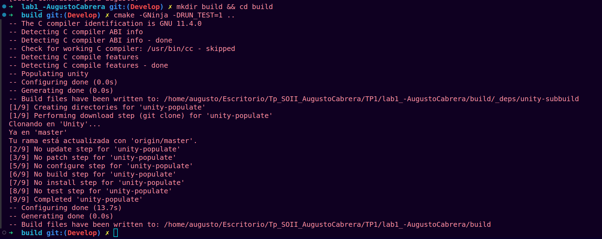

  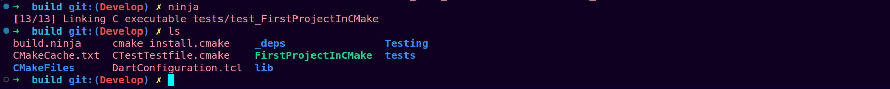

Several files are generated where `_deps` are the dependencies with the Unity library.

To run the tests, execute:

  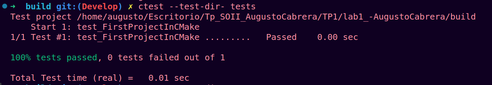

You can run the following command to get a bit more description:

  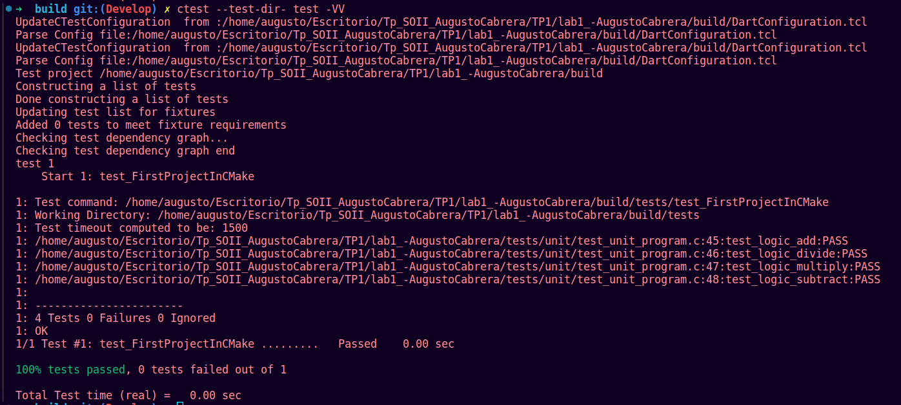

Now, for `Coverage`, we do:

  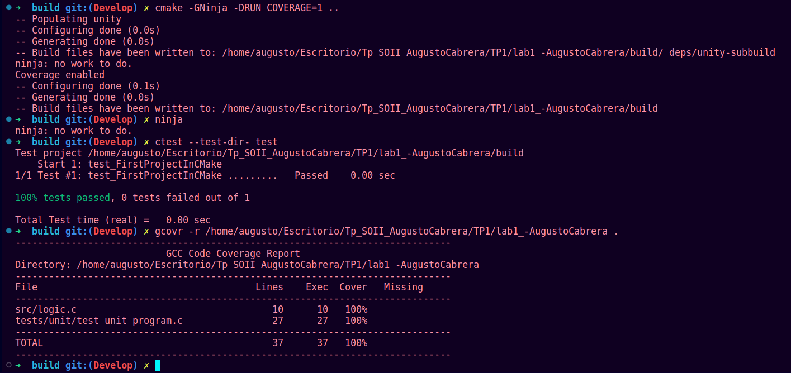

## 📌 GitHub Actions Configuration
1. Create a GitHub Actions configuration file in the repository.
2. Include steps to compile the code, run tests, and optionally deploy the project.
3. Configure specific workflows for pull requests.

### Solution

GitHub Actions are defined within the `.github` directory. Below is the configuration of the check in GitHub Actions.

  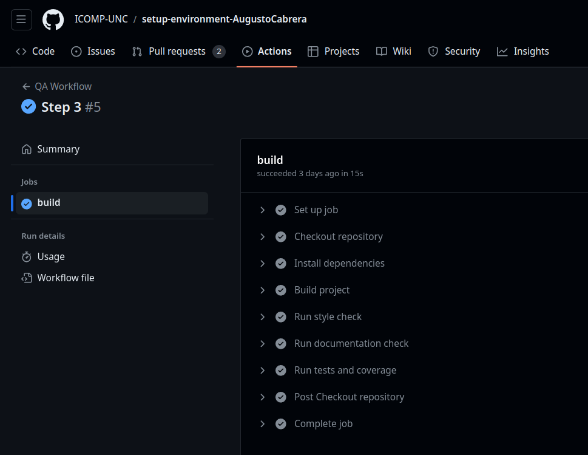

## 📌 PLUS: SonarQube 🛸 and CDash

To start SonarQube locally, apply the command `sh ./sonar.sh console` in `/opt/sonarqube-10.4.1.88267/bin/linux-x86-64/`.

  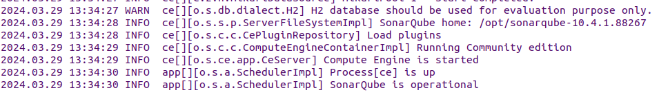

Now, we generate the necessary `.xml` files (defined in *sonar-project.properties*).

  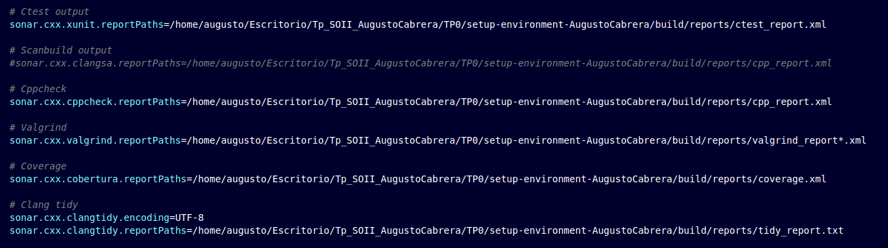

With the following commands:

1. `cd build`
2. `ninja clean`
3. `cmake -GNinja -DRUN_COVERAGE=1 -DCMAKE_EXPORT_COMPILE_COMMANDS=1 ..`
   - `-DCMAKE_EXPORT_COMPILE_COMMANDS=1`: Export compilation commands to a compile_commands.json file. This file is used by some static analysis and code completion tools.
4. `ninja`
5. `cd ..`
6. `ctest --test-dir ./build/tests -VV --output-junit ./../reports/ctest_report.xml`: This command runs project tests using CTest. Detailed explanation:
   - `--test-dir ./build/tests`: Specifies the directory where the test executables are located.
   - `-VV`: Activates detailed test output.
   - `--output-junit ./../reports/ctest_report.xml`: Generates a test report in JUnit format and saves it in the reports directory.
7. `gcovr -r . ./build --cobertura ./build/reports/coverage.xml`: This command generates a code coverage report using Gcovr. Detailed explanation:
   - `-r .`: Specifies the root directory for generating the coverage report.
   - `./build`: Specifies the directory where compiled binary files are located.
   - `--cobertura ./build/reports/coverage.xml`: Generates a code coverage report in Cobertura XML format and saves it in the reports directory.
8. `cppcheck --enable=all -i ./lib/cJSON --suppress=missingIncludeSystem -I include -I lib/ENRM/include --xml src lib 2> ./build/reports/cpp_report.xml`: This command performs static code analysis using cppcheck. Detailed explanation:
   - `--enable=all`: Enables all cppcheck checks.
   - `-i ./lib/cJSON`: Excludes the lib/cJSON directory from analysis.
   - `--suppress=missingIncludeSystem`: Suppresses warnings related to missing system include files.
   - `-I include -I lib/ENRM/include`: Specifies additional include directories.
   - `--xml src lib 2> ./build/reports/cpp_report.xml`: Generates a static analysis report in XML format and saves it in the reports directory.
9. `clang-tidy --format-style=file -p build/ src/*.c lib/ENRM/src/*.c > ./build/reports/tidy_report.txt`: This command performs static code analysis using Clang-Tidy. Detailed explanation:
   - `--format-style=file`: Uses the project's .clang-format file for code formatting style.
   - `-p build/`: Specifies the build directory where the compile_commands.json file is located.
   - `src/*.c lib/ENRM/src/*.c`: Specifies the C files to analyze.
   - `> ./build/reports/tidy_report.txt`: Redirects the static analysis output to a text file in the reports directory.
10. `ctest -S Pipeline.cmake`: This command executes a specific test script (Pipeline.cmake) using CTest. This script can contain a series of custom test steps.

and we obtain the `.xml` files.

  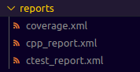

Applying the sonar-scanner to the path and executing the command `~ sonar-scanner  -Dsonar.host.url=http://localhost:9000/ -Dsonar.token=sqp_72f8aa0...`

  

To run CDash, simply ensure that the container is up.

  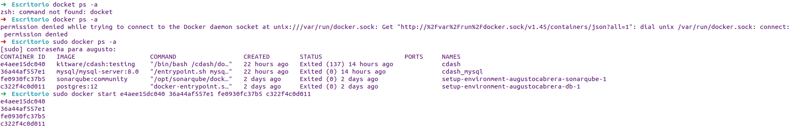

and then access port 8080.

  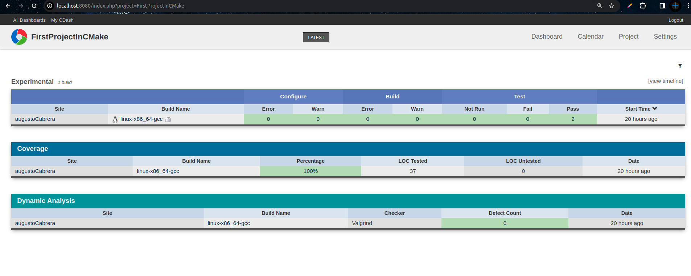

---

BASHHH!

-build:  "sudo ./runLab.sh"
-TEST: hacer los test: "ctest --test-dir- tests"
para hacer mas info: "ctest --test-dir- test -VV"

-clang-format: usar con  "clang-format -i logic.c"

